## CRACKME [Lilsan44444](https://crackmes.one/crackme/682113c96297cca3ff7d7834)

Crackme de https://crackmes.one/crackme/682113c96297cca3ff7d7834

Usare IDA para resolver este CTF de un programa en C++

Al lanzar el ejecutable vemos comos como nos solicita una contraseña, introducimos una de prueba y nos devuelve `bad boy wrong password`

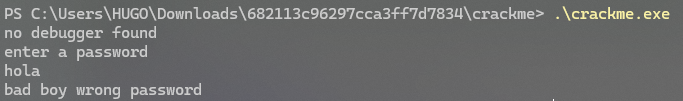

Abrimos el ejecutable con IDA y comenzamos a analizarlo

Lo primero que vemos es una llamada a la función DebuggerCheck, en el readme del CTF avisan tambien de esto por lo que no podremos resolverlo dinamicamente.

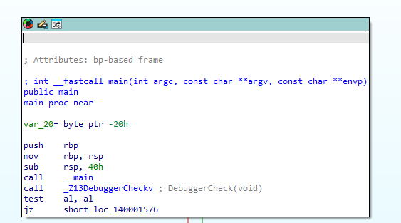

Si pasamos el debugger check pasamos al siguiente fragmento:

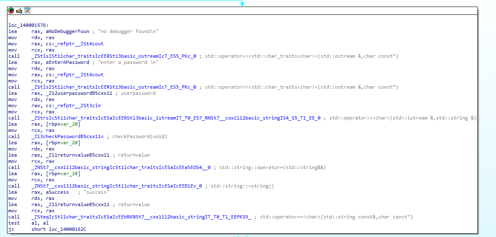

Aqui podemos ver como se llama a std::cout dos veces para pintar por consola

`no debugger found`

y

`enter a password`

Despues de pintar esto por consola podemos ver ya algo interesante, una variable ya iniciliazada llamada `userpassword`

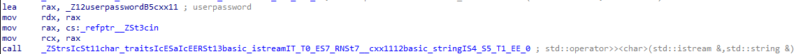

En el fragmento de la captura podemos ver como guarda en el registro RAX la direccion de memoria efectiva de esta variable `userpassword`

Despues la mueve al registro RDX, para llamar al metodo std::cin

Este metodo asigna el valor del input del usuario en la direccion de memoria del registro RDX

Lo que seria en C++ `std::cin >> userpassword;`

En el siguiente fragmento podemos ver como se llama a la funcion checkPassword();

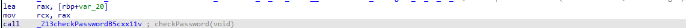

Saltamos a la funcion para ver que ocurre en ella:

En ella podemos ver como se cargan la direccion efectiva de memoria de las variables definidas `userpassword` y `passwd`

Despues se llama al operator == y si el test sale positivo devolveremos el string `success`, en caso contrario `invalidpassword`

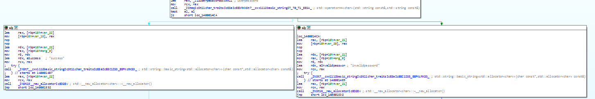

Si revisamos la inicialización de la variable passwd vemos que esta vacia
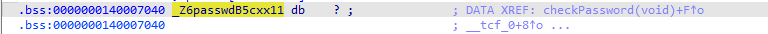

Gracias a IDA podemos ver en la vista XREF todas las referencias cruzadas a esta direccion de memoria:
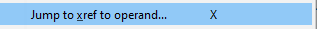

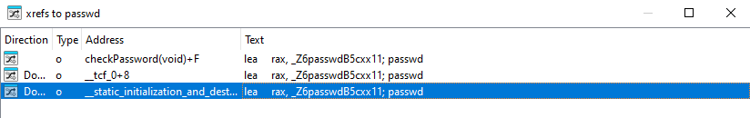

Este programa esta hecho en C++, se esta utilizando el objeto std::string por lo que XREF nos chiva el valor que se le asigna cuando se llama al constructor del objeto std::string

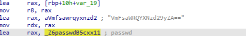

En ese fragmento podemos ver como se esta cargando el pointer a `.rdata:00000001400040CA aVmfsawrqyxnzd2 db 'VmFsaWRQYXNzd29yZA==',0`

En la variable `passwd`

Por lo que podemos dar por hecho que nuestro input se esta comparando con `VmFsaWRQYXNzd29yZA==`

Probamos y:

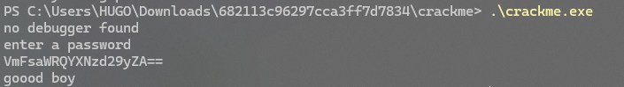

La funcion checkPassword devuelve un string, `success` o `checkpassword`

En caso de devolver success salta al siguiente procedimiento que pinta `goood boy` y sale del programa con codigo exit 0:
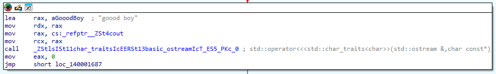

En caso contrario pinta `bad boy wrong password` y sale con codigo exit 1:

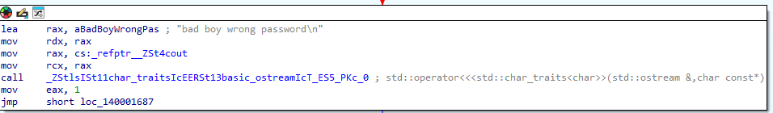

